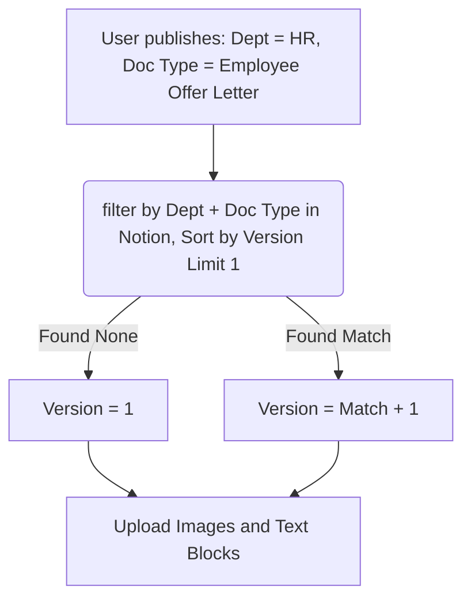

# ⚡ DocForge AI & CiteRAG

> AI-powered document generation with automatic Notion publishing, version control, and a conversational RAG support agent with built-in RAGAS evaluations.


---

## Table of Contents

- [Overview](#overview)
- [Features](#features)
- [Project Structure](#project-structure)
- [Quick Start](#quick-start)
- [Docker Deployment](#docker-deployment)
- [Environment Variables](#environment-variables)
- [API Reference](#api-reference)
- [Version Control & Publishing](#version-control--publishing)
- [Flowchart Rendering](#flowchart-rendering)
- [Redis Caching](#redis-caching)
- [Departments & Document Types](#departments--document-types)
- [Notion Database Schema](#notion-database-schema)
- [CiteRAG — Conversational RAG Agent](#citerag--conversational-rag-agent)
- [RAGAS Evaluation & Exports](#ragas-evaluation--exports)
- [Tech Stack](#tech-stack)
- [License](#license)

---

## Overview

**DocForge AI** is a full-stack AI document generation platform. It uses **Azure OpenAI** to generate professional, department-specific documents and publishes them to a **Notion database** with full metadata tracking and automatic version control.

A second major subsystem — **CiteRAG** — is a tool-calling conversational RAG agent. It lets users ask questions about ingested documents, automatically creates Notion support tickets when confidence is low, and manages the entire ticket lifecycle through natural language.

---

## Features

### Document Generation
- **🧠 Advanced Intelligence**: Powered by Azure OpenAI (GPT-4o Mini).
- **🚀 Ultra-Fast RAG**: Optimized for sub-second vector retrieval and response generation.
- **📄 100 Document Types**: NDA, Privacy Policy, SLA, Employment Contract, and more.
- **🏢 Multi-Department**: Custom behaviors tailored for HR, Finance, Legal, Sales, IT, Operations, etc.
- **📝 Notion Sync**: One-click publishing with auto-versioning and full metadata tracking.
- **📈 Version Control**: Persistent Notion-based version history per Department/DocType.
- **📊 Dynamic Flowcharts**: Automatic Mermaid rendering to Notion image blocks hosted natively.
- **💾 Redis Optimized**: High-speed caching for generation, retrieval, and session memory.

### CiteRAG Support Agent
- **🧠 Agentic Memory**: Unified 30-day persistent history (Redis-backed) synchronized across cache hits and agent turns.
- **⚡ High-Performance RAG**: Optimized "Direct-Shot" retrieval pipeline (Vector Search → LLM) for minimum latency; no speculative background cycles.
- **🖱️ Scroll-Stable UI**: Callback-driven interaction (Streamlit `on_click` & `st.empty()`) ensures smooth navigation without "jumping" to the top or blank-page flashing.
- **💎 Premium UX**: Beautiful dark-mode interface with micro-animations, glassmorphism, and dynamic follow-up suggestions.
- **🛡️ 3-Layer Security**: Azure Content Filter → LLM System Guard → Action-Specific Cache Guard.
- **🌐 Global Retrieval**: Native support for Hindi, Hinglish, Marathi, and Gujarati queries.
- **🤖 LLM-First Architecture**: All tool selection, security, and intent routing handled by GPT-4o-mini — zero hardcoded keyword lists.
- **🎫 Ticket Lifecycle**: Auto-creates Notion support tickets for low-confidence answers; full ticket management via natural language.
- **🔍 Smart Deduplication**: LLM-based duplicate ticket detection before creating new Notion entries.

### RAGAS Evaluation Framework built-in
- **✅ Faithfulness & Relevancy**: Embedded programmatic checks to see if RAG outputs are accurate.
- **✅ Precision & Recall**: Benchmarked automatically against 15 human-curated ground trust sets in `qa_dataset.json`.
- **✅ Rapid Exporting**: Live evaluation data exportable natively to DOCX Reports (`ragas_report_YYYYMMDD.docx`) and JSON formats seamlessly.

---

## Project Structure

```
docForge_AI-main/
├── backend/
│   ├── agents/
│   │   └── agent_graph.py          # Tool-calling architecture & intent routing
│   ├── api/
│   │   ├── routes.py               # Core document generation endpoints
│   │   ├── agent_routes.py         # Support ticket & Notion REST utilities
│   │   └── rag_routes.py           # Conversational RAG (/ask, /ingest) endpoints
│   ├── core/
│   │   ├── config.py               # Global settings & environment loading
│   │   ├── llm.py                  # Azure OpenAI client initialization
│   │   └── logger.py               # Structured logging configuration
│   ├── models/
│   │   └── document_model.py       # Core document data entities
│   ├── prompts/
│   │   ├── prompts.py              # Specialized templates for 100+ document types
│   │   └── quality_gates.py        # Multi-stage output validation logic
│   ├── rag/
│   │   ├── ingest_service.py       # Optimized Notion-to-ChromaDB sync engine
│   │   ├── rag_service.py          # High-speed retrieval & answer generation 
│   │   ├── ragas_scorer.py         # Automated inline RAG evaluation & scoring
│   │   ├── system_prompt.py        # CiteRAG agent system instructions
│   │   └── ticket_dedup.py         # Semantic duplicate ticket detection
│   ├── schemas/
│   │   ├── document_schema.py      # Pydantic models for document requests
│   │   └── notion_schema.py        # Mapping schemas for Notion properties
│   ├── services/
│   │   ├── db_service.py           # Persistent document storage logic
│   │   ├── document_utils.py       # Content formatting & metadata helpers
│   │   ├── generator.py            # Azure GPT-4o Mini generation service
│   │   ├── notion_service.py       # Notion API wrapper & version control logic
│   │   └── redis_service.py        # Unified caching & 30-day session store
│   └── main.py                     # FastAPI application entry point
├── ui/
│   └── streamlit_app.py            # Callback-driven Streamlit frontend with RAGAS UI
├── chroma_db/                      # Local vector database storage (Ephemeral/Persistent)
├── docx_builder.py                 # Word (DOCX) Document synthesis and exporting engine
├── flowchart_renderer.py           # Mermaid → PNG rendering service using Imgur
├── docker-compose.yml              # Multi-container orchestration
├── requirements.txt                # Python dependencies
└── .env.example                    # Template for environment configuration
```

---

## Quick Start

### Prerequisites
- Python 3.11+
- Redis (optional, for caching)
- Azure OpenAI resource with GPT-4o Mini and text-embedding-3-large deployments
- Notion Internal Integration token — [notion.so/my-integrations](https://www.notion.so/my-integrations)
- Imgur Client ID (optional, for flowchart rendering) — [api.imgur.com/oauth2/addclient](https://api.imgur.com/oauth2/addclient)

### 1. Clone the repository
```bash
git clone https://github.com/Tilakvasani/docForge_AI.git
cd docForge_AI
```

### 2. Create a virtual environment
```bash
python3.11 -m venv venv
# Windows
venv\Scripts\activate
# Mac / Linux
source venv/bin/activate
```

### 3. Install dependencies
```bash
pip install -r requirements.txt
```

### 4. Configure environment variables
```bash
cp .env.example .env
```
Edit `.env` with your credentials (see Environment Variables).

### 5. Start the backend
```bash
uvicorn backend.main:app --reload
```

### 6. Start the frontend (new terminal)
```bash
streamlit run ui/streamlit_app.py
```
Open `http://localhost:8501` in your browser.

---

## Docker Deployment

Deploy the entire stack (FastAPI, Redis, Streamlit) simultaneously:
```bash
docker-compose up --build
```

This starts:
| Service | Port |
|---------|------|
| FastAPI backend | `8000` |
| Streamlit frontend | `8501` |
| Redis | `6379` |

---

## Environment Variables

```env
# Notion Variables
NOTION_TOKEN=secret_...
NOTION_DATABASE_ID=...           # Source documents / published docs DB
NOTION_TICKET_DB_ID=...          # Support ticket tracking DB

# Redis
REDIS_URL=redis://localhost:6379

# Azure OpenAI — LLM (document generation + agent + RAGAS evaluation)
AZURE_OPENAI_LLM_KEY=...
AZURE_LLM_ENDPOINT=https://your-resource.openai.azure.com/
AZURE_LLM_DEPLOYMENT_41_MINI=gpt-4o-mini
AZURE_LLM_API_VERSION=2024-12-01-preview

# Azure OpenAI — Embeddings (RAG & Retrieval)
AZURE_OPENAI_EMB_KEY=...
AZURE_EMB_ENDPOINT=https://your-resource.openai.azure.com/
AZURE_EMB_DEPLOYMENT=text-embedding-3-large
AZURE_EMB_API_VERSION=2024-02-01

# Optional Integrations
IMGUR_CLIENT_ID=...              # Enables flowchart image mapping in Notion
DATABASE_URL=...                 # If using a relational DB
APP_ENV=development              # development | production
LOG_LEVEL=INFO                   # INFO | DEBUG | WARNING
```

---

## API Reference

### Document Generation
| Method | Endpoint | Description |
|--------|----------|-------------|
| `GET` | `/api/departments` | List all available departments |
| `GET` | `/api/sections/{doc_type}` | Get sections for a document type |
| `POST` | `/api/questions/generate` | Generate initial context questions for a section |
| `POST` | `/api/answers/save` | Save user contextual answers into state |
| `POST` | `/api/section/generate` | Generate section text using Document AI Engine |
| `POST` | `/api/section/edit` | Re-generate/Edit a specific generated section |
| `POST` | `/api/document/save` | Push the local document into DB |
| `POST` | `/api/document/publish` | Master Publish hook to Notion (with version bump) |
| `GET` | `/api/library/notion` | Fetch all previously published documents |

### CiteRAG & Agents
| Method | Endpoint | Description |
|--------|----------|-------------|
| `POST` | `/api/rag/ask` | High-performance tool-calling conversational interaction |
| `POST` | `/api/rag/ingest` | Ingests Notion database into ChromaDB via embeddings |
| `GET` | `/api/rag/status` | Current ChromaDB statistics |
| `DELETE` | `/api/rag/cache` | Flushes all vector retrieval memory from Redis |
| `POST` | `/api/rag/eval` | Evaluate an interaction natively using RAGAS |
| `GET` | `/api/rag/scores?key=` | Retrieve current async RAGAS task states |

### Agent Tickets / Admin
| Method | Endpoint | Description |
|--------|----------|-------------|
| `GET` | `/api/agent/tickets` | Returns all Notion DB tickets currently logged |
| `POST` | `/api/agent/tickets/update`| Auto patches ticket statuses inside Notion via LLM Action |
| `GET` | `/api/agent/memory?session` | Grabs the current 30 day conversation history for session |
| `POST` | `/api/agent/ticket/create` | Forcibly logs a new ticket (usually hit internally) |
| `DELETE` | `/api/agent/dedup/flush` | Wipes the LLM Ticket Deduplication logic map |

### Example — Publish a Document
```bash
curl -X POST "http://localhost:8000/api/document/publish" \
  -H "Content-Type: application/json" \
  -d '{
    "doc_id": "abc-123",
    "doc_type": "Employee Offer Letter",
    "department": "HR",
    "gen_doc_full": "Full document content here...",
    "company_context": {
      "company_name": "Acme Corp",
      "industry": "SaaS",
      "region": "India",
      "company_size": "50-200"
    }
  }'
```
**Response Returns Notion Page Details:**
```json
{
  "notion_url": "https://notion.so/page-id",
  "notion_page_id": "xxxxxxxx-xxxx-xxxx-xxxx-xxxxxxxxxxxx",
  "version": 2
}
```

---

## Version Control & Publishing

DocForge AI implements automatic **Notion-based version control**. Every publish checks whether a document with the same **Department + Doc Type** already exists.



| Publish # | Department | Doc Type | Auto-Assigned Version |
|-----------|------------|----------|---------|
| 1st | HR | Employee Offer Letter | v1 |
| 2nd | HR | Employee Offer Letter | v2 |
| 1st | Finance | Invoice Template | v1 |
*Each combination holds an independent version counter natively inside Notion!*

---

## Flowchart Rendering

Documents containing Mermaid blocks are parsed during publish.
`docForge` runs string matching to detect ````mermaid` syntax, automatically rendering it into PNG via Python. Then it leverages Imgur APIs to get public image links for Notion.
If no keys are defined, it safely falls back to formatted readable numbered lists.

---

## Redis Caching

DocForge heavily relies on Redis to maintain massive speed.

| Cache Key | Data Type Cached | Default TTL |
|-----------|---------------|-------------|
| `docforge:agent:history:{id}`| Multi-turn Chat History | **30 Days / 2592000s** |
| `answer:{hash}` | Extracted RAG response values | 1 Hour |
| `departments` | Available Generation Arrays | 1 Hour |
| `sections:{type}` | Base Doc_type outlines | 1 Hour |
| `notion_library` | Published library directory | 5 Minutes |

---

## Departments & Document Types

### Supported Departments
`HR`, `Finance`, `Legal`, `Sales`, `Marketing`, `IT`, `Operations`, `Customer Support`, `Product Management`, `Procurement`

### Popular Document Types Selected
| Doc Type | Description |
|------|-------------|
| **NDA** | Non-Disclosure Agreement |
| **Privacy Policy** | GDPR/CCPA compliant external facing policy |
| **Terms of Service** | Software/Platform terms and conditions |
| **Employment Contract** | Full-time/part-time employment agreement |
| **Employee Offer Letter** | Standard job formal offer detailing compensations |
| **SLA** | Service Level Agreements highlighting uptimes |
| **Business Proposal** | Client focused sales contracts |
| **Compliance Report** | SOC2, HIPAA compliance internal audits |
| **Invoice Template** | Finance focused billing invoice structures |

---

## Notion Database Schema Requirements

If spinning this up from scratch, your Notion setup needs:

### Published Documents DB
| Property Name | Property Type | Value Source |
|-------|------|-------------|
| Title | Title | Auto generated: `{Doc Type} — {Company}` |
| Department | Select | Pre-defined options (HR, Legal...) |
| Doc Type | Rich Text | String representation |
| Industry | Rich Text | Configured via session_state |
| Version | Number | Determined via lookup query |
| Status | Select | `Generated` / `Draft` / `Published` |
| Created By | Rich Text | System identifier |

### Ticket DB (CiteRAG)
| Property Name | Property Type | Value Source |
|----------|------|---------|
| Question | Title| User's unanswerable question string |
| Status | Select | Open, In Progress, Resolved |
| Priority | Select | Assigned via LLM logic |
| Attempted Sources | Multi-select| Fetched during retrieval attempt |
| Session ID | Rich Text | Linked Session to allow user follow up |

---

## CiteRAG — Conversational RAG Agent

A single-turn, state-less LLM prompt governs the entirety of CiteRAG, selecting from an array of robust internal tools dynamically.

### Agent Tools Included
| Tool Trigger / Intent | Internal Node Used | Details |
|------|-----------------|--------|
| Complex Policy queries | `tool_search` | Standard Direct-Shot retrieval with answer cache. |
| "Summarize the SLA" | `tool_refine` | Leverages HyDE generation constraints to build executive summary. |
| "Read full handbook" | `tool_full_doc` | Maxes out vector query returns to reconstruct document. |
| "Compare Policy A to B"| `tool_compare`| Retrieves both, builds table showing alignment & differences. |
| "Find risks in..." | `tool_analysis` | Deep gap analysis for legal exposure and contradictions. |
| Multistage queries | `multi_query` | Splits request: *Who is Jane and what's her email?* |
| Low Confidence hits | `create_ticket`| If confidence scores tank, prompts automated Ticket flow. |
| "Resolved ticket #2" | `update_ticket`| Edits the Notion Object ID directly via human request. |
| Threat Injection | `block_off_topic`| Security Layer intercepts off-role attacks seamlessly. |

### Ingestion Pipeline Engine
1. Hits API `/api/rag/ingest`, reads Notion blocks.
2. Formats lists, toggles, tables as paragraph-aware embeddings.
3. Batches to ChromaDB (`#rag_chunks`) natively.
4. Generates internal ID tracking for immediate deduplication on re-ingest!

---

## RAGAS Evaluation & Exports

DocForge AI includes native testing arrays for document generation metrics using `RAGAS`. 
Users can hit the **Batch Evaluation** interface:
1. Runs background async analysis on Question / RAG Answer pairings.
2. Checks **Faithfulness** (no hallucinations), **Answer Relevancy**, **Context Precision**, & **Context Recall**.
3. Employs `qa_dataset.json` mapping to securely compare answers.
4. Exports gracefully via **JSON Downloads** or full multi-page **DOCX Reports**. The `ragas_report_YYYYMMDD.docx` file houses Executive level summary tables followed by granular single-query breakdowns.

---

## Tech Stack

| Layer | Primary Technology | Usage Purpose |
|-------|-----------|----------|
| **AI LLM Engine** | Azure OpenAI (GPT-4o Mini) | Brain of CiteRAG, Document Engine, Ragas |
| **Embeddings** | Azure OpenAI (`text-embedding-3-large`)| Generates semantic space coordinates |
| **Vector Index** | ChromaDB | Ephemeral/Persistent query search speeds |
| **Backend REST** | FastAPI & Pydantic | Typing, Error Boundaries, Thread performance |
| **Frontend CLI**| Streamlit | Visual interfaces via `st.empty` architecture|
| **Database CRM** | Notion API | Document Storage Versioning & Ticket Tracking |
| **Caching Tier** | Fast Redis | Retains sessions, blocks DDOS, caches Answers |
| **Render Engine**| Mermaid | Logic charts into readable graphical flow paths |
| **Reporting Eng**| python-docx | For Ragas and DocForge Word file creation |

---

## License
MIT License. Open for modification, iteration, and enterprise scaling.

---
Built with ⚡ by [Tilak Vasani](https://github.com/Tilakvasani)
